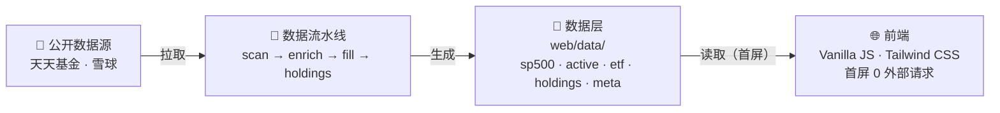

# US Fund Tracker · 美股基金追踪看板

一个专注于**美股 QDII 基金**的追踪看板。纯静态部署，零后端。

🌐 **在线看板**：<https://zhouminghan.github.io/qdii-tracker/>
📦 **源码仓库**：<https://github.com/zhouminghan/qdii-tracker>

[](https://github.com/zhouminghan/qdii-tracker/actions/workflows/update-data.yml)
[](https://github.com/zhouminghan/qdii-tracker/blob/main/LICENSE)

> 🛠 **想自己部署一套？** 跳到末尾 [👉 部署方式](#-部署方式)：GitHub Pages 零服务器、零成本、自动更新。

---

## ✨ 核心功能

- **双 Tab · 8 分组**：场外基金（标普500 / 纳指100 / 美股主动 / 全球指数 / 全球其他）+ 场内 ETF（标普500 / 纳指100 / 全球其他），Chips 一键切换；分组标题/副标题/表头日期/行内日期全联动
- **📈 历史走势图**：弹窗 SVG 折线图，9 档区间（1月 ~ 全部），Crosshair 悬停交互，底部净值列表可展开全部
- **📊 持仓详情 Modal**：基础信息 + 业绩 8 维度 + 费率结构 + Top10 重仓股（实时行情 + 5 分钟自动刷新）
- **🏷️ 市场参照系**：5 张实时指标卡（道琼斯 / 标普500 / 纳指综合 / 纳指100 / 美元汇率），点击可查看历史日 K 线；美股市场状态标签
- **份额对比 + 费率**：A/C/D/E/F/H/I 份额并列，费率 tooltip（管理费+托管费+销售服务费 + 原价/1折对比）
- **列头排序**：净值涨跌 / 近1月 / 今年来 / 近1年 / 成立来 / 申购状态 / ETF 溢价率
- **申购一目了然**：暂停/日限额徽章 + 分组汇总额度横幅 + 悬停查看最近 3 次申购变更历史
- **📸 截图分享**：卡片式设计（外层大框 + 内层市场卡/表格双区）；可选净值列；7 种风格 × 3 种布局；筛选分类/风格/显示列；动态跟随列宽；一键导出 PNG 存相册
- **纯静态首屏**：本地 JSON 零外部请求；按需加载实时净值 / 走势图 / ETF 溢价率
- **智能轮询调度**：场外实时净值（5 档分时调度）+ ETF 溢价率（盘中 60s），Settled 自动停止；页面隐藏/空闲自动暂停
- **数据陈旧检测**：数据过期自动提示警告横幅；Meta 30 分钟自动检查更新

---

## 🏗️ 整体架构



> 🚀 **部署形态**：纯 GitHub Pages 静态托管，**无后端运行时、无数据库、无 Docker**。

---

## 📂 目录结构

```
qdii-tracker/
├── scripts/                  # 数据流水线（Python）
│   ├── fundctl.py            # 统一入口（add/move/refresh/sync/check）
│   ├── core/                 # 共享基础设施
│   ├── sources/              # 数据源抽象层（akshare/eastmoney/xueqiu）
│   └── pipeline/             # scan → enrich → fill → holdings
├── web/                      # 前端（纯静态）
│   ├── index.html            # 主入口（489 行）
│   ├── css/                  # Tailwind + app.css（样式独立文件）
│   ├── js/                   # 11 个模块（main/config/utils/screenshot/market-indices 等）
│   └── data/                 # 消费的 JSON（sp500/nasdaq_passive/active/global_index/global_other/etf/meta/holdings）
└── .github/workflows/        # update-data.yml + deploy-pages.yml
```

---

## 🧪 数据流水线（4 步）

| 步骤 | 脚本 | 做什么 | 耗时 |
|---|---|---|---|
| ① | `pipeline.scan` | 扫描全量 QDII 基金，按规则分类，归组成系列 | ~30s |
| ② | `pipeline.enrich` | 补规模/费率/基金经理/收益（逐只调雪球） | ~5min |
| ③ | `pipeline.fill` | 净值/日涨跌/YTD + ETF 场内价 + 申购状态 + 历史追踪 | ~2min |
| ④ | `pipeline.holdings` | 抓主动基金 Top10 重仓 | ~2min |

> 📝 `global_index.json`（全球非美指数·日经225 / 中韩半导体等）名字含"日经/韩"等会被 `EXCLUDE_KEYWORDS` 过滤，由 `FORCE_INCLUDE_CODES` 白名单机制纳入 scan，全程 4 个脚本都覆盖。

### 自动更新时间表

| 时间（北京） | 频率 | 模式 | 步骤 |
|---|---|---|---|
| 22:00 晚间主力（QDII 净值披露后） | 工作日 | 增量 | ③ |
| 每月 2 日 02:00 | 月度 | 完整 | ①→②→③→④ |
| 手动 Run workflow | 按需 | 可选 | 按选择 |

---

## ➕ 新增基金

**方式 A：统一入口新增（推荐）**

```bash
cd scripts
python3 fundctl.py add --code 002891 --to active --keyword "华夏移动互联"
```

> 会自动完成：更新 `config/funds.json` → 扫描 + 单只增量补数（`--codes`）→ 按需补持仓。

**方式 B：手动编辑 JSON（临时补加单只、不想跑完整扫描时）**

1. 用 `ak.fund_name_em()` 查同系列代码
2. 在 `web/data/{分类}.json` 的 `series` 末尾追加骨架
3. 跑补数据脚本（enrich + fill + holdings）

> ⚠️ `pipeline.scan` 会**覆盖** `web/data/*.json`，方式 A 跑完 scan 后必须接 enrich + fill；方式 B 补数据脚本不会覆盖已有字段。

详细字段规范、踩坑列表、Bug 史 详见 [`AGENT.md`](./AGENT.md)。

---

## 🔍 分类规则

`pipeline.scan` 分类优先级（`classify_fund`）：force_exclude → force_include → 非 QDII → EXCLUDE_KEYWORDS → 标普/纳指/美股关键词（命中后场内走 `is_etf` 分流，场外归对应被动/主动分组）→ 未命中则 exclude。`global_index` 通过 `force_include` 白名单纳入，`active`（美股主动）通过 `active_whitelist` 关键词从泛美股候选中筛入。详见 [`AGENT.md`](./AGENT.md)。

---

## 🛠 常见问题

**Q: 数据不是今天的？**
A: QDII 净值 T+1 披露，今天看到的通常是前一交易日的净值。Actions 22:00 那轮覆盖绝大多数。

**Q: 某只基金数据不对/为空？**
A: 跑 `pipeline.fill` 补缺；还是空说明数据源本身没有（新基金，等披露）。

**Q: 想加/删基金？**
A: 优先用 `scripts/fundctl.py`（`add` / `move`），需要全量重刷时再用 `sync`。

**Q: 远端（GitHub Pages）实时净值/指标卡日 K 不显示？**
A: 东方财富部分接口对 GitHub Pages 等跨站来源限制访问（本地正常但远端失败）。已做双链路兜底（lsjz → pingzhongdata；push2his → push2），仍可能有偶发不可用。本地开发环境不受影响。

---

## 🚀 部署方式

**GitHub Pages + Actions 自动更新**：免费 / 零服务器 / 自动定时刷数据。

### 📋 首次配置步骤

1. **创建 Public 仓库** `qdii-tracker`
2. **推送代码** `git push -u origin main`
3. **Settings → Pages → Source** 选 `GitHub Actions`
4. **Settings → Actions → General → Workflow permissions** 选 `Read and write permissions`
5. **Actions → Update Fund Data → Run workflow** 手动跑一次验证
6. 访问 `https://{username}.github.io/qdii-tracker/`

### 日常使用

- 打开书签看网页即可
- 想立刻更新：Actions → Run workflow → 选「增量更新（快速·净值+申购）」→ 等几分钟刷新

---

## 💻 本地开发

```bash
# 1. 装依赖
cd scripts
pip install -r requirements.txt

# 2. 跑一次完整流水线
python3 fundctl.py sync

# 3. 启动前端
cd ../web
python3 -m http.server 8765
# 浏览器打开 http://localhost:8765/

# 日常增量更新（交易日 22:00 QDII 净值披露后）
cd scripts && python3 fundctl.py refresh   # fill 已包含申购状态+历史追踪

# 一致性校验
cd scripts && python3 fundctl.py check
```

---

## 📜 License

本项目基于 **[MIT License](./LICENSE)** 开源。
**数据免责**：本项目仅聚合公开数据做展示，不构成投资建议。基金有风险，投资需谨慎。
