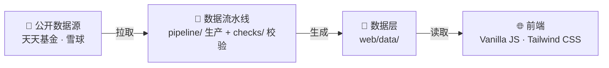

# US Fund Tracker · 美股基金追踪看板

美股 QDII 基金追踪看板。纯静态部署，零后端。**🤖 Agent 模式开箱即用**（Codex 自动读 AGENT.md + knowledge/）。

🌐 **在线看板**：<https://zhouminghan.github.io/qdii-tracker/>
📦 **源码仓库**：<https://github.com/zhouminghan/qdii-tracker>

[](https://github.com/zhouminghan/qdii-tracker/actions/workflows/update-data.yml)
[](https://github.com/zhouminghan/qdii-tracker/blob/main/LICENSE)

## ✨ 核心功能

- **双 Tab · 8 分组**：场外基金（标普500 / 纳指100 / 美股主动 / 全球指数 / 全球其他）+ 场内 ETF
- **📈 历史走势图**：弹窗 SVG 折线图，9 档区间，Crosshair 悬停交互
- **📊 持仓详情 Modal**：业绩 8 维度 + 费率结构 + Top10 重仓股（实时行情）
- **🏷️ 市场参照系**：道琼斯 / 标普500 / 纳指 / 美元汇率实时指标卡 + 历史日 K
- **📸 截图分享**：卡片式设计，7 种风格 × 3 种布局，一键导出 PNG
- **纯静态首屏**：本地 JSON 零外部请求，按需加载实时数据
- **智能轮询**：5 档分时调度，Settled 自动停止，页面隐藏自动暂停

## 🏗️ 架构


```mermaid
graph LR
    A["📡 公开数据源<br/>天天基金 · 雪球"]
    B["🐍 数据流水线<br/>pipeline/ 生产 + checks/ 校验"]
    C["📁 数据层<br/>web/data/"]
    D["🌐 前端<br/>Vanilla JS · Tailwind CSS"]

    A -->|拉取| B
    B -->|生成| C
    C -->|读取| D
```

> 纯 GitHub Pages 静态托管，无后端、无数据库、无 Docker。

## 📂 目录

```
qdii-tracker/
├── scripts/          # 数据流水线（Python）
│   ├── fundctl.py    # 统一入口（add/remove/move/refresh/sync/check/diagnose）
│   ├── pipeline/     # 数据生产（scan/enrich/fill/holdings/reclassify/codegen）
│   ├── checks/       # 质量门禁（verify_data/cross_validate/diagnose/architecture_lint）
│   ├── sources/      # 数据源（akshare/eastmoney/xueqiu）
│   └── core/         # 共享基础设施（constants/utils/config_loader）
├── config/
│   └── funds.json    # 基金分类 SSOT 配置
├── web/              # 前端（纯静态）
│   ├── index.html
│   ├── css/          # app.css + tailwind.css
│   └── js/           # config / utils / render-trend / main / screenshot
├── knowledge/        # 解释记忆 — Agent 知识库
│   ├── INDEX.md      # 总索引 + 架构全景
│   ├── gotchas.md    # 踩坑记录 + 生命周期
│   ├── pipeline-contracts.md  # 模块输入/输出契约
│   ├── data-sources.md        # 数据源 + API端点 + 降级策略
│   ├── data-schema.md         # JSON 字段定义
│   └── golden-fixtures.md     # 黄金样例
├── .codegraph/       # 代码图谱（结构记忆，自动维护）
└── test/             # 本地测试（gitignored）
```

Agent 规则详见 [AGENT.md](./AGENT.md)。

## 🚀 部署（GitHub Pages）

1. 创建 Public 仓库，推送代码
2. Settings → Pages → Source: `GitHub Actions`
3. Settings → Actions → Workflow permissions: `Read and write`
4. Actions → Run workflow 验证 → 访问 `https://{user}.github.io/qdii-tracker/`

日常：打开网页即可。想立刻更新 → Actions → Run workflow。

## 💻 本地开发

```bash
cd scripts && pip install -r requirements.txt
python3 fundctl.py sync
python3 fundctl.py check          # 门禁（必须全绿）
cd ../web && python3 -m http.server 8765
# 日常维护：
python3 fundctl.py add --code X --to Y       # 新增
python3 fundctl.py remove --code X            # 删除
python3 fundctl.py move --keyword X --from A --to B  # 调分类
python3 fundctl.py refresh                    # 增量刷新
```

## 📜 License

[MIT License](./LICENSE)。数据仅聚合公开信息展示，不构成投资建议。
