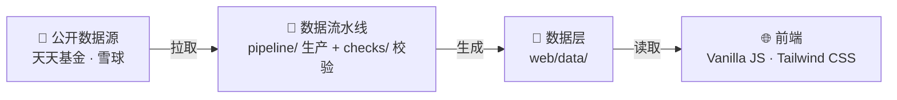

# US Fund Tracker · 美股基金追踪看板

美股 QDII 基金追踪看板。纯静态部署，零后端。**🤖 Agent 模式开箱即用**（Codex 自动读 AGENTS.md + knowledge/）。

🌐 **在线看板**：<https://zhouminghan.github.io/qdii-tracker/>
📦 **源码仓库**：<https://github.com/zhouminghan/qdii-tracker>

[](https://github.com/zhouminghan/qdii-tracker/actions/workflows/update-data.yml)
[](https://github.com/zhouminghan/qdii-tracker/blob/main/LICENSE)

## ✨ 核心功能

- **双 Tab · 8 分组**：场外基金（标普500 / 纳指100 / 美股主动 / 全球指数 / 全球其他）+ 场内 ETF
- **📈 历史走势图**：弹窗 SVG 折线图，9 档区间，Crosshair 悬停交互
- **📊 持仓详情 Modal**：业绩 8 维度 + 费率结构 + Top10 重仓股（实时行情）
- **🏷️ 市场参照系**：道琼斯 / 标普500 / 纳指 / 美元汇率实时指标卡 + 历史日 K
- **📸 截图分享**：卡片式设计，7 种风格 × 3 种布局，一键导出 PNG
- **纯静态首屏**：本地 JSON 零外部请求，按需加载实时数据
- **智能轮询**：5 档分时调度，Settled 自动停止，页面隐藏自动暂停

## 🏗️ 架构


```mermaid
graph LR
    A["📡 公开数据源<br/>天天基金 · 雪球"]
    B["🐍 数据流水线<br/>pipeline/ 生产 + checks/ 校验"]
    C["📁 数据层<br/>web/data/"]
    D["🌐 前端<br/>Vanilla JS · Tailwind CSS"]

    A -->|拉取| B
    B -->|生成| C
    C -->|读取| D
```

> 纯 GitHub Pages 静态托管，无后端、无数据库、无 Docker。

## 📂 目录

<!-- DOCSYNC START: tree -->
```text
qdii-tracker/
├── .github/    # CI 工作流（deploy-pages / update-data / ci）
│   └── workflows/
├── .githooks/    # 本地 pre-commit 钩子（提交前自动 doc_sync）
│   └── pre-commit
├── scripts/    # 数据流水线（Python）
│   ├── checks/
│   ├── core/
│   ├── pipeline/
│   ├── sources/
│   ├── fundctl.py
│   ├── requirements-dev.txt
│   ├── requirements-ui.txt
│   ├── requirements.txt
│   └── setup_hooks.sh
├── config/    # 基金分类 SSOT 配置
│   └── funds.json
├── web/    # 前端（纯静态）
│   ├── css/
│   ├── data/
│   ├── js/
│   ├── .nojekyll
│   ├── index.html
│   ├── robots.txt
│   └── sitemap.xml
├── knowledge/    # 解释记忆 — Agent 知识库
│   ├── INDEX.md
│   ├── data-schema.md
│   ├── data-sources.md
│   ├── golden-fixtures.md
│   ├── gotchas.md
│   └── pipeline-contracts.md
├── test/    # 测试与 UI 回归（pytest + Playwright）
│   ├── ui_scenarios/
│   ├── run_ui_scenarios.py
│   ├── test_classify.py
│   └── test_utils.py
├── .gitignore
├── AGENTS.md
├── LICENSE
└── README.md
```
<!-- DOCSYNC END: tree -->

Agent 规则详见 [AGENTS.md](./AGENTS.md)。

## 🚀 部署（GitHub Pages）

1. 创建 Public 仓库，推送代码
2. Settings → Pages → Source: `GitHub Actions`
3. Settings → Actions → Workflow permissions: `Read and write`
4. Actions → Run workflow 验证 → 访问 `https://{user}.github.io/qdii-tracker/`

日常：打开网页即可。想立刻更新 → Actions → Run workflow。

## 💻 本地开发

```bash
cd scripts && pip install -r requirements.txt
./scripts/setup_hooks.sh                      # 启用 pre-commit 文档同步（一次性）
python3 fundctl.py sync                       # 全量同步
python3 fundctl.py check --agent-rules        # 门禁 + Agent 规则 + 文档同步
python3 fundctl.py check --offline            # 断网/CI 时跳过 Layer 6 跨源验证
cd ../web && python3 -m http.server 8765      # 本地开发
```

日常维护命令（由 `doc_sync.py` 自动生成，请勿手改）：

<!-- DOCSYNC START: commands -->
```bash
python3 fundctl.py add          # 新增/强制纳入一只基金
python3 fundctl.py move         # 移动分类
python3 fundctl.py remove       # 删除一只基金（从配置和数据中移除）
python3 fundctl.py refresh      # 增量刷新
python3 fundctl.py sync         # 全量同步
python3 fundctl.py diagnose     # 诊断数据异常
python3 fundctl.py check        # 一致性校验
python3 fundctl.py probe        # 数据源适配层探针（导入级）
```
<!-- DOCSYNC END: commands -->

```bash
cd scripts && python3 checks/doc_sync.py --fix   # 手动文档同步

# UI 回归（仅本地跑；云端 CI 不跑，避免每次下载 Chromium）
pip install -r scripts/requirements-ui.txt       # 一次性
python -m playwright install chromium            # 一次性（约 94MB）
python test/run_ui_scenarios.py                  # 跑 6 条浏览器回归场景
```

## 📜 License

[MIT License](./LICENSE)。数据仅聚合公开信息展示，不构成投资建议。
